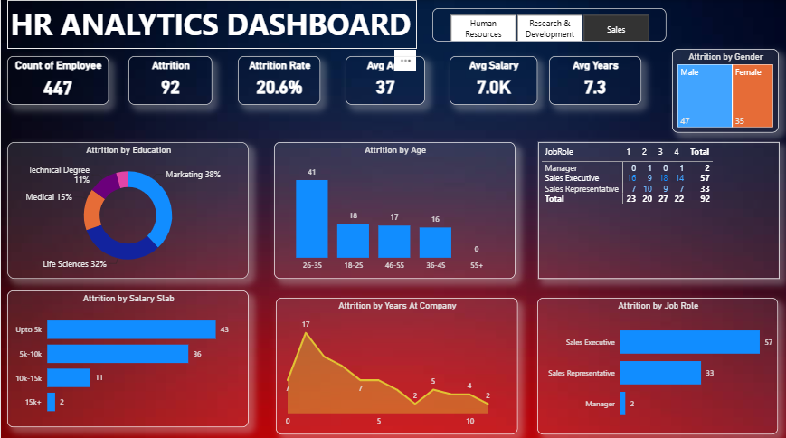

# HR Analytics Dashboard – Power BI

An interactive HR analytics dashboard built in Power BI to analyze employee 
attrition across departments, age groups, salary bands, and tenure.

## 📊 Dashboard Preview

## 🎯 Objective
To help HR stakeholders identify attrition patterns and key risk segments 
(department, age, salary, tenure) to support data-driven retention strategies.

## 🛠️ Tools Used
- Power BI (Data Modeling, DAX)
- Excel / CSV (data source)

## 📈 Key Metrics
- Total Employees: 447
- Total Attrition: 92
- Attrition Rate: 20.6%
- Average Age: 37 | Average Salary: 7.0K | Average Tenure: 7.3 years

## 🔍 Key Insights
- Sales Executives account for the highest attrition (57 employees).
- Employees aged 26–35 show the highest attrition rate.
- Attrition is highest in the "Upto 5K" salary slab, suggesting a 
  compensation-linked retention risk.
- Attrition peaks around year 0–1 of tenure, indicating onboarding/early 
  retention gaps.

## 📁 Project Structure
- `HR_Analytics_Dashboard.pbix` – Power BI file
- `dataset/` – Source data used for the dashboard
- `screenshots/` – Dashboard visuals
- `docs/` – Insights summary

## 🚀 How to Use
1. Download the `.pbix` file.
2. Open it in Power BI Desktop.
3. Explore the interactive filters (HR, R&D, Sales tabs).

